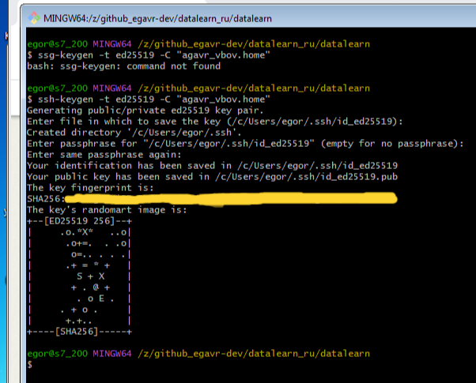
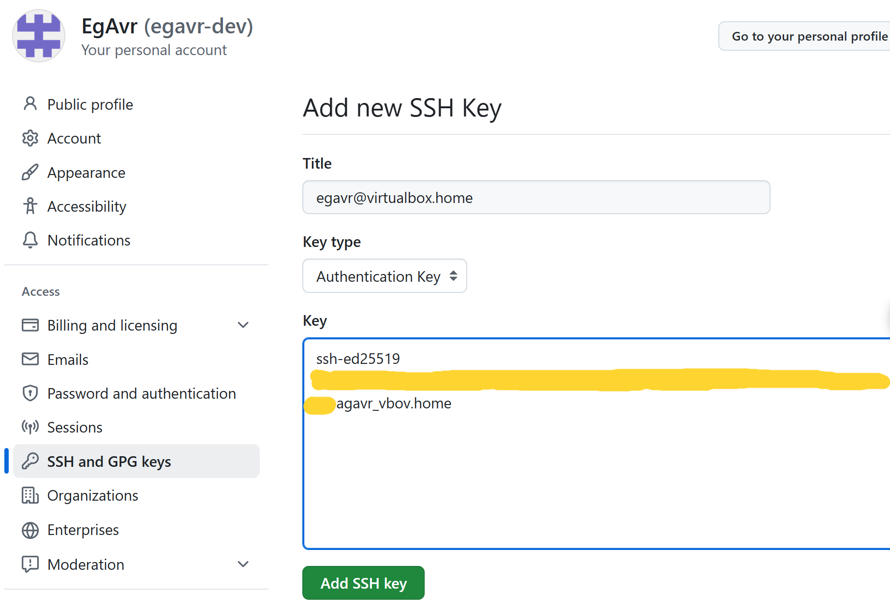
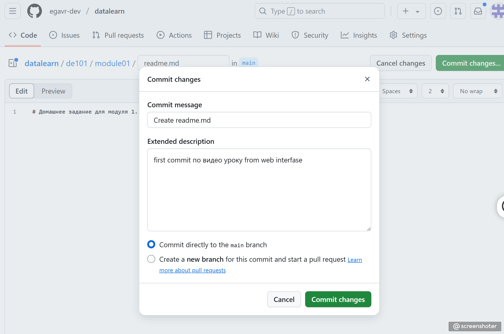
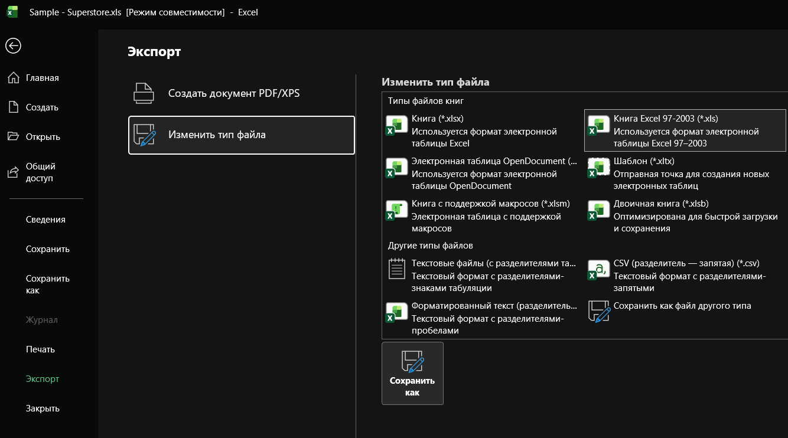
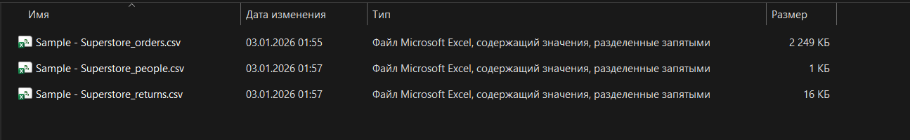
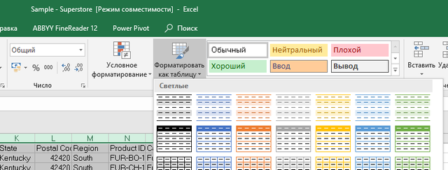

# Домашнее задание для модуля 1.

## Установка Gihub Desktop, git
Установим git программу для консоли, для контроля версий наших файлов

1) Шаг работы с git и добавление клучей SSH

Поработаем в интерфейсе сайта gihub.com

2) Шаг добавления репозитория на gihub.com

3) Шаг добавления файла readme.md в папку de101/module01

## О языке Markdown

Можно почитать по [ссылке](https://stackedit.io/app#)

## Next уровень сложности это сделать все в командной строке

Сделаем изменения в файле и сделаем commit и затем push в удаленный репозиторий при помощи ssh который 
сделали на предыдущих шагах.

## Шаг знакомства с данными
Сохраним исходный файл в [папке](/de101/data/Sample%20-%20Superstore.xls)

В исходном файле видим три вкладки в которых содержаться данные по:

- orders - заказам магазина
- people - людям, видимо покупателям магазина
- returns - возвратам товаров в магазин

Сохраним из предыдущего файла формата .xls данные в формате .csv поместив данные 
в следующие файлы делаем это из интерфейса excel (файл -> сохранить_как -> ):

Получатся файлы с разделителем точка с запятой хотя написано в интерфэйсе excel 
что разделитель данных запятая

1. de101/data/transform_to_csv/Sample%20-%20Superstore_orders.csv - путь к orders (заказы)
2. de101/data/transform_to_csv/Sample%20-%20Superstore_people.csv - путь к people (люди)
3. de101/data/transform_to_csv/Sample%20-%20Superstore_returns.csv - путь к returns (возвраты)

Теперь открываем исходный файл и идем по шагам из [источника курса](https://github.com/Data-Learn/data-engineering/blob/master/DE-101%20Modules/Module01/DE%20-%20101%20Lab%201.1/build_steps_dashboard.md) 
Итак, выделяем имеющиеся данные на листе Orders и идем в excel 
Вкладка "Главная" -> "Форматировать как таблицу" или горячие клавиши "Crtl+T" 
-> ставим галочку в "Таблица с заголовками"

Выглядит это так:

Перейдем во вкладку "Конструктор" и зададим таблице имя, чтобы потом быстро к ней обращаться.

- таблице orders зададим имя t_orders
- таблице people зададим имя t_people
- таблице returns зададим имя t_returns

Добавим два файла 

- "Sample - Superstore.xlsx" исходный файл данных в новом формате excel
- "Sample_Superstore_dashboard.xlsx" модификационный файл для упражнений в курсе

Теперь можно объединить все данные в одну таблицу и в дальнейшем работать только 
с ней. Помимо удобства, это также даст возможность строить фильтры и срезы, 
которые будут применяться сразу ко всем данным и диаграммам в дашборде.

## Шаг объединение данных в одну таблицу

Объединять данные будем во вкладке Orders. Там по умолчанию больше всего данных, 
есть общие поля с другими таблицами: "Region", "Order ID", "Product ID". Ну и самое важное 
именно здесь у нас минимальная грануляция. Значит, мы сможем построить более 
детализированные отчеты.

1 Для начала добавим недостающие столбцы "Person" и "Returned"

Чтобы подтянуть данные из вкладки People, можно воспользоваться функцией "Если"
в excel. Формула будет выглядеть так:

`=ЕСЛИ([@Region]="West"; "Anna Andreadi"; ЕСЛИ(M3="East"; "Chuck Magee"; ЕСЛИ(M3="Central"; "Kelly Williams"; ЕСЛИ(M3="South"; "Cassandra Brandow"; "not_date!!!"))))`

тут:

- [@Region]="West" - это обращение к полу таблицы на текущей странице
- M3 - это обращение к ячейке М2 на текущей странице

В итоге получаем таблицу, где для каждого региона указан его менеджер.

Если таблице присвоено имя 

Чтобы подтянуть данные по возвратам из вкладки Returns, можно 
воспользоваться сразу несколькими функциями ИНДЕКС, ПОИСКПОЗ, ЕСЛИОШИБКА, ВПР,
ПРОСМОТРХ (XLOOKUP)

В качестве альтернативы можно использовать функцию ВПР (VKLOOKUP).
Мой вариант формулы такой:

`=ПРОСМОТРX(B2;t_returned[Order ID]; t_returned[Returned];"No")`

- первый аргумент - что искать
- второй аргумент - где искать
- третий аргумент - что вывести при нахождении совпадения
- четвертый [необязательный] - что вывести в случае ненахождения совпадений

## Шаг определимся с нужными отчетами

