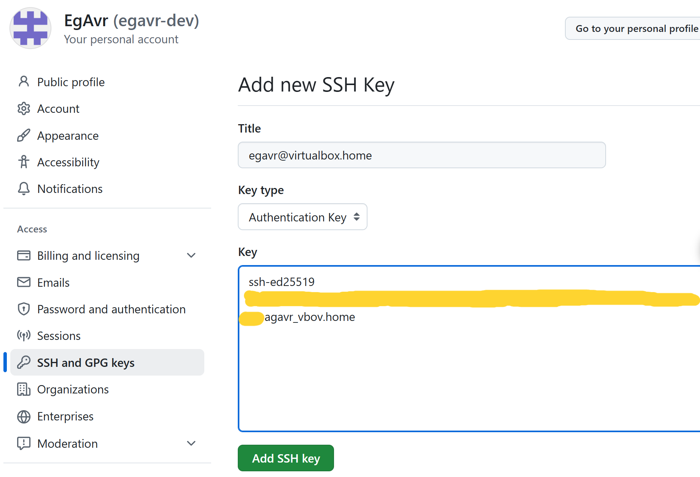
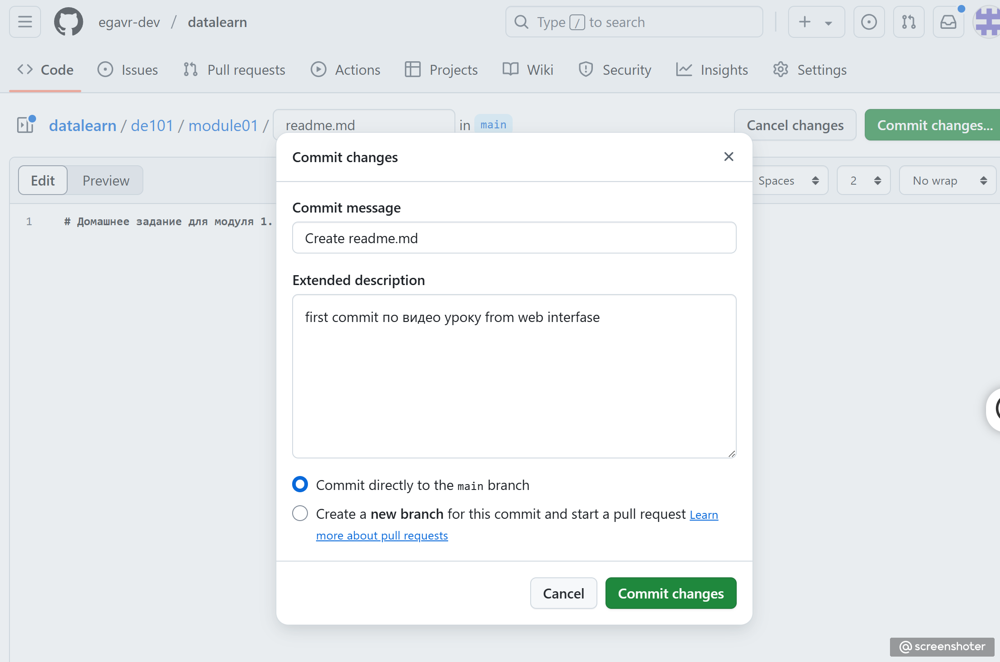

# Домашнее задание для модуля 1.

## Установка Gihub Desktop, git
Установим git программу для консоли, для контроля версий наших файлов

1) Шаг работы с git и добавление клучей SSH

Поработаем в интерфейсе сайта gihub.com

2) Шаг добавления репозитория на gihub.com

3) Шаг добавления файла readme.md в папку de101/module01

## О языке Markdown

Можно почитать по [ссылке](https://stackedit.io/app#)

## Next уровень сложности это сделать все в командной строке

Сделаем изменения в файле и сделаем commit и затем push в удаленный репозиторий при помощи ssh который сделали на предыдущих шагах
